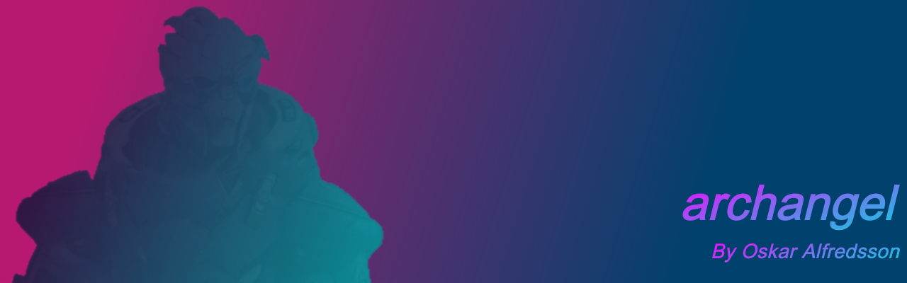
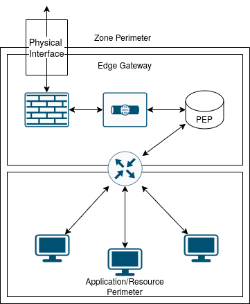
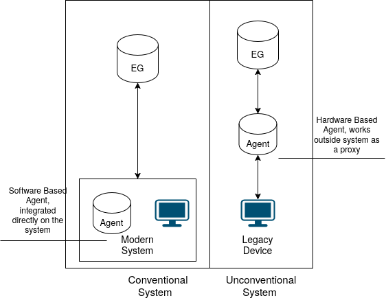
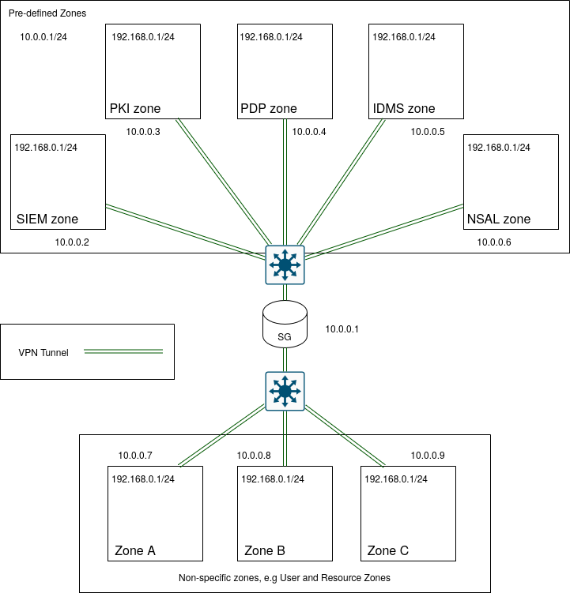
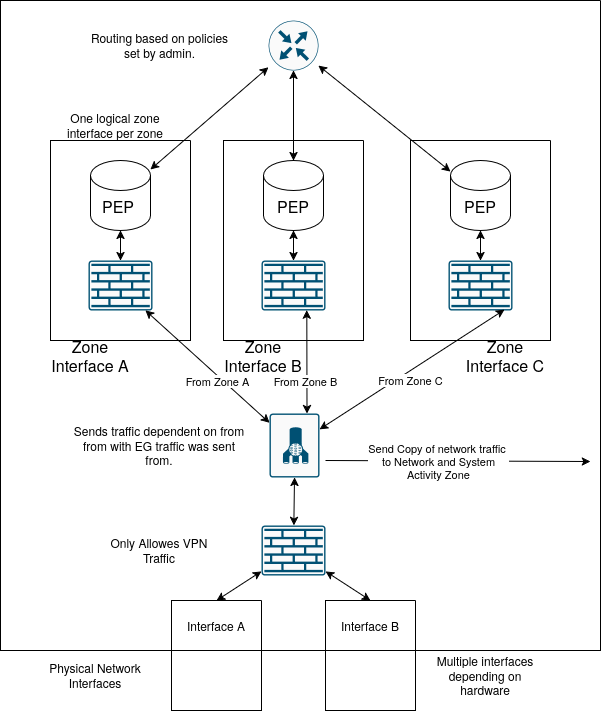

<p align="center">
    
</p>

<h3 align="center">Project is written in C++.</h3>
<br>

<p align="center">
  
  
  
  
  <!-- https://shields.io/badges/ -->
</p>

<br>

# About

The goal of this project is to build a open source firewall that can rival the UniFi echosystem in user experience. This program is built as a backend for a seperate frontend project, so this program only exposes endpoints that other programs can get and post to (see [routes](docs/endpoints.md) for possible endpoints). This project is just in its infancy and I do this on my freetime so dont expect something good, just doing this for the fun of it.  

This software is also a continueation of my [thesis work](docs/Zero_Trust_i_Komplexa_Isolerade_Miljöer.pdf), but it is in Swedish! If you are wondering what this project would compare to in my thesis work, it would be the Edge Gateway module. The idea is to create a firewall application that would work as both a proxy for server communication and keep communication secure.

```
    | Clients  | Client Endpoint |    Network Edge Zone   | Central Node
    -------------------------------------------------------
    Server 1   ->      RG        ->         EG1          ->
    Server 2   ->      RG        ->                      ->  
    -------------------------------------------------------
    Server 3   ->      RG        ->         EG2          ->
    -------------------------------------------------------    SG
    Client 1   -> Device Agent   ->         EG3          ->
    Client 2   -> Device Agent   ->                      ->
    -------------------------------------------------------
    Client 3   -> Device Agent   ->         EG4          ->
    -------------------------------------------------------
```


"Clients" to "Client Endpoint" represent a logical network where earch client/server require either a Resource Gateway (for servers) or a Device Agent (for user clients), both used to setup a secure communication betweem device and Edge Gateway. The Resouce Gateway is meant to add Access control to network resources (firewalls for now, resource permissions and more later), and the Device Agent is used to enable authentication between Client and Edge Gateway AND Client and Resource Gateway, the Device Agent provices authentication credentials that is used for access control.



The idea for this is to keep networks segmented. Only authenticated traffic can leave each segemented network, divided by a Edge Gateway, so traffic between Servers can occure, only if it is on the same segmented network, but this also imply that the servers have a reason to communicate (e.g Webserver that needs a database). You could say that each Edge Gateway that holds a resource delive one service, not more. This is to segment networks in case of any cyberattack against a service, so we could apply zero trust principles to each Edge Gateway to deny network access in case of suspicious behavior (unregular network traffic etc).


Logical communications between segmented networks can only be done between the a Segmentation Gateway. The idea is to route traffic between RG/DA <-> EG <-> SG, and do it in a secure way (mainly encrypt traffic), so a VPN like connection is done between RG/DA and EG, and between EG and SG (Segmentation Gateway). This is done both to secure non-encrypted traffic (e.g FTP or any other non-encrypted protocol), and to hinder outside espionage and packet capturing, like AI traffic analysis (see [DAITA](https://mullvad.net/sv/vpn/daita)). This also have the added benifit to also be used in current "non-secure" networks, e.g you could have a compromised or non-secured network switch between a RG/DA->EG and EG->SG without having the risk of other people read or manipulate network traffic.


The role of the SG is to have a logical seperation between Edge Gateways, by having different VPN connections between each EG (Network Zone), and route traffic between them based on Access Control. This makes it so that EG could share a physical connection, but not nessesarly be aware of each other.


# Software Features
- [ ] Basic firewall routing
- [ ] Basic DNS Resolver
- [ ] Basic DHCP Server
- [ ] Device discovery
- [ ] Deep Packet Inspection
- [ ] Device Enrollment (requires additional projects, like raspberry PI can act as a AP)
- [ ] Web based frontend
- [ ] Port discovery

And more...

## Dashboard Features
- [ ] Network Topology
- [ ] Iteractive firewall management
- [ ] Visual packet flow

And more...


## FaQ
- Is this vibe coded?
No, but it could include AI generated code, but I try to make a effort to note it in the commit message/description. This project is both a passion project for me, and also a way for me to extend my knowledge in C/C++.

- Will this project be completed?
I hope so, I plan on implement this solution for my own servers, but it will take some time to come to a stage where it is usable.

- Can I contribute to this project?
Yes! For the time being, create a feture request under "Issues" so we can discuss it!

- Why Archangel?
It is a refrence to Garrus nickname in Mass Effect 2, the name could change in the future!
